[andriidrok.com](https://andriidrok.com) &nbsp;·&nbsp;
[instagram](https://www.instagram.com/andrii_drok/) &nbsp;·&nbsp;
[linkedin](https://www.linkedin.com/in/andriidrok/) &nbsp;·&nbsp;
[email](mailto:clb@mirasvit.com)

### Kartikey Bhatnagar | Engineer 

Full-stack engineer. I like building systems from the ground up and understanding the trade-offs behind them. Most of my time goes into figuring out what’s happening underneath the abstractions, especially when something breaks, needs to scale, or needs to be more reliable and fault-tolerant. I enjoy building the infrastructure around products just as much as building the products themselves.

<samp>

**LANGUAGES &amp;** 
JavaScript&nbsp;&nbsp; TypeScript&nbsp; C++&nbsp;&nbsp; Python 

**DATA** 
MongoDB&nbsp;&nbsp; PostgreSQL&nbsp;&nbsp; SQL&nbsp;&nbsp; Redis&nbsp;&nbsp; HTML 
CSS&nbsp;&nbsp; C++&nbsp;&nbsp; Python 

**BACKEND &amp; WEB** 
React&nbsp;&nbsp; Next.js&nbsp;&nbsp; Tailwind CSS&nbsp;&nbsp; Node.js&nbsp;&nbsp; Express&nbsp;&nbsp; Prisma&nbsp;&nbsp;   Firebase 
Supabase&nbsp;&nbsp; Appwrite&nbsp;&nbsp; ShadCN&nbsp;&nbsp; Framer Motion&nbsp;&nbsp; Clerk&nbsp;&nbsp; Postman 

**DEVOPS &amp; INFRASTRUCTURE** 
Vercel&nbsp;&nbsp; Netlify&nbsp;&nbsp; Render&nbsp;&nbsp; Git&nbsp;&nbsp; RabbitMQ&nbsp;&nbsp; Docker&nbsp;&nbsp; AWS 

**OBSERVABILITY** 
Prometheus&nbsp;&nbsp; Alertmanager&nbsp;&nbsp; Loki&nbsp;&nbsp; Tempo&nbsp;&nbsp; OpenTelemetry&nbsp;&nbsp; ELK Stack 
k6
</samp>

**[YSync](https://github.com/kartikey2004-git/YSync)** &nbsp;·&nbsp; <samp>WebSockets Redis IndexedDB Sequence CRDT</samp> 
Custom sequence CRDT for real-time collaborative editing. WebSocket sync with   causal merging and presence broadcasting. Supports 50+ concurrent clients with <20ms propagation and zero data loss across offline conflicts.

**[Kyron](https://github.com/kartikey2004-git/AI-Code-Review)** &nbsp;·&nbsp; <samp>Octokit Inngest pgvector RAG</samp> 
Durable PR review pipeline via Inngest. Tree-sitter AST chunking, pgvector retrieval, Gemini review, and GitHub comments. End-to-end review under 45s for PRs <500 lines. Incremental indexing cuts embedding API calls by ~80%.

**[SQLFlow](https://github.com/kartikey2004-git/SQLFlow)** &nbsp;·&nbsp; <samp>PostgreSQL MongoDB Express.js Next.js</samp> 
Multitenant SQL sandbox with isolated PostgreSQL schemas. Dynamic schema provisioning, safe untrusted query execution, and type-normalized result grading. Dual-database architecture with TTL-based audit logs for bounded storage growth.

Every graphic here is generated, not embedded from anyone else's server. 
`ascii.svg` is a photo pushed through a character ramp by 
[`scripts/make_portrait.py`](scripts/make_portrait.py); the stat graphics and 
these section headings are drawn by [a scheduled action](.github/workflows/stats.yml) 
straight from the GitHub GraphQL API, once a day, committing only what changed.

They animate with SMIL inside the SVG, because GitHub strips scripts from 
READMEs — and since nothing loads from a third party, nothing here can 
rate-limit or go dark. The headings are SVGs for the same reason: GitHub also 
strips CSS, so an image is the only way to put this page's own typeface on them.

The typeface is [JetBrains Mono](scripts/fonts), subset to just the characters 
each graphic draws and inlined as base64. That isn't only for looks: the 
portrait's grid assumes an advance width of exactly 0.600 em, and a viewer whose 
default monospace is narrower would otherwise see it squeezed.

Language totals cover public repositories only. `year.svg` uses the portrait's 
character ramp: `:` `+` `#` `@`, quiet to loud.
